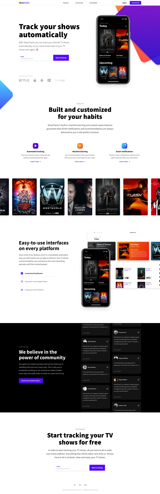

# Victor Neves: sass-single-page-webite

This is an alternative version of the this project [sass-single-page-website](https://github.com/vitorlmneves/sass-single-page-website)) using a little of javascript to handle the transition of images and without the infinite carousel.

## INSTALLATION

1. Open **Terminal** if you are on macOS or **CMD** if on Windows
2. Open the project folder (`cd project/`)
3. Run `npm install` --> install local dependencies from **package.json**
4. Run `npm install gulp` --> install local gulp dependency

&nbsp;

## DEVELOP

1. Run `gulp watch` --> (runs the project in dev mode, starts a local server and opens the window on the local server endpoint)
2. Run `gulp build` --> (generate build)

&nbsp;

---

&nbsp;

### FINISH

When you finish you should run `gulp build` to generate all files into the `dist/` folder.

&nbsp;

### TECH

The source files (editable) are located in the `src/` folder.
To ensure the integrity of the project you should only edit these files inside this folder.
The gulp scripts are able to handle with preprocessing (html, sass, etc...)

&nbsp;

### OUTPUT

The build version will be available at dist folder.

---

&nbsp;

#### Desktop image (property of [Daniel Korpai](https://danielkorpai.com/))

&nbsp;

---

&nbsp;

#### Mobile image (property of [Daniel Korpai](https://danielkorpai.com/))

